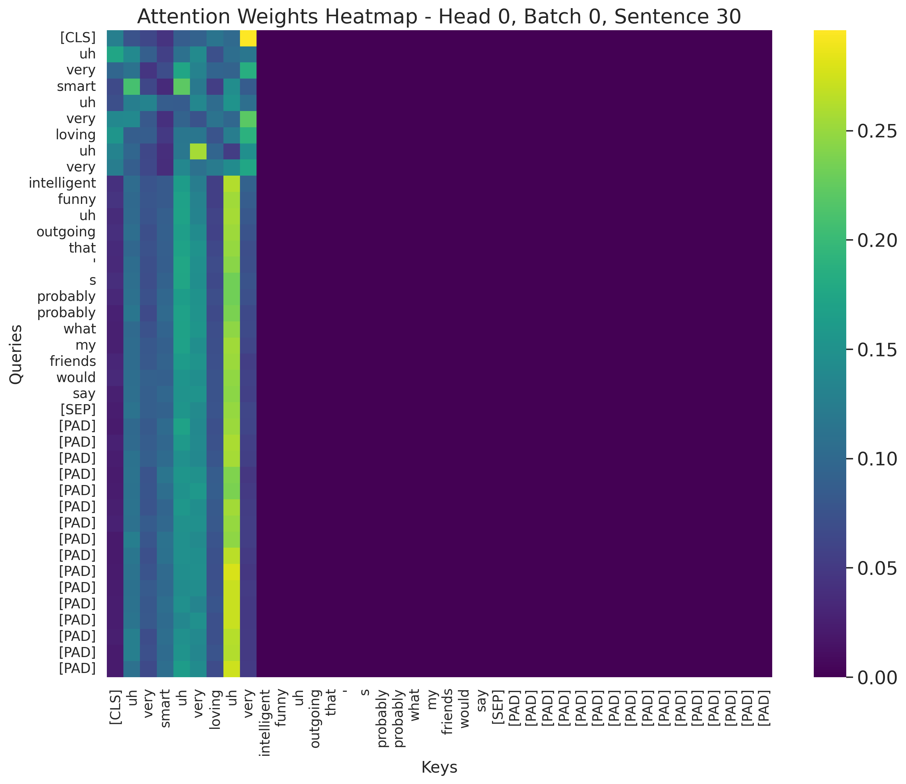

# Automatic Depression Detection Using An Interpretable Audio-Textual Multi-modal Transformer-based Model

This repository contains the code for a research project focused on detecting depression through a multi-modal approach, utilizing both audio and textual data from clinical interviews. The model is based on a transformer architecture, leveraging the self-attention mechanism to improve both diagnostic accuracy and interpretability. The model outperforms baseline models and provides insights into key factors influencing depression diagnosis through attention analysis.

### Authors:
- Mehrshad Saadatinia (saadatin@usc.edu)
- Pin-Tzu Lee (pintzule@usc.edu)
- Sreya Reddy Chinthala (chinthal@usc.edu)
- Om Jodhpurkar (jodhpurk@usc.edu)
- Sneh Thorat (snehpram@usc.edu)

## Datasets
We use the following two datasets for training and evaluation:

1. **DAIC-WOZ (Distress Analysis Interview Corpus Wizard-of-Oz)**  
   A dataset designed to aid in diagnosing psychological distress, including depression, anxiety, and PTSD. The dataset contains audio and text data annotated with depression labels based on PHQ-8 scores.  
   [Link to Dataset](https://dcapswoz.ict.usc.edu/)

2. **EATD (Emotional Audio-Textual Dataset Corpus)**  
   A dataset consisting of Chinese audio and text interview data with depression levels based on the SDS (Self-Rating Depression Scale). It includes both positive and negative sentiments for each subject.  
   [Link to Dataset](https://github.com/speechandlanguageprocessing/ICASSP2022-Depression)

## Methodology
We propose a multi-modal framework for depression detection, which integrates audio and text features. Key steps include:

1. **Feature Extraction**  
   - **Text**: Use BERT embeddings to extract text features. Each subject’s sentence is represented by the mean of BERT word-level embeddings.
   - **Audio**: Generate mel-spectrograms from audio, then use a NetVLAD layer to extract compact and robust audio embeddings.

2. **Model Architecture**  
   - Transformer encoders for both audio and text modalities.
   - Concatenate features from both modalities and pass through fully connected layers for classification.

3. **Interpretability**  
   - Attention weights are analyzed to identify the most influential features in both audio and text data, providing explainability for the model's predictions.

## Results
### Performance Metrics
Our experiments demonstrate the effectiveness of the proposed model on both datasets. The results show consistent improvements in diagnostic accuracy and F1 scores compared to baseline models.

#### DAIC-WOZ Results
| Model | F1 Score |
|-------|----------|
| Audio LSTM | 0.78 |
| Text LSTM | 0.76 |
| Text & Audio Bi-LSTM & GRU + Attention | 0.74 |
| **Text & Audio Multi-modal Model (Proposed)** | **0.82** |

#### EATD Results
| Model | F1 Score |
|-------|----------|
| Audio LSTM | 0.80 |
| Text LSTM | 0.79 |
| Text & Audio Bi-LSTM & GRU + Attention | 0.71 |
| **Text & Audio Multi-modal Model (Proposed)** | **0.84** |

### Interpretability Results
The interpretability of the model was evaluated by analyzing attention weights for both audio and textual features. Key observations include:

- **Text Modality**:  
  The attention mechanism highlighted specific words and phrases as significant in detecting depression. For instance:  
  - Words such as "loving," "intelligent," and "funny" were given distinct weights, reflecting their relevance in the model's predictions.  
  - The heatmap below illustrates the attention weights for a sample sentence, where key terms are weighted based on their importance:  

    

- **Audio Modality**:  
  Attention analysis in the audio modality revealed the following:  
  - Features such as reduced pitch variability and slower speech rate were consistently flagged as significant.  
  - The heatmap below shows how specific audio frames were assigned higher attention weights, emphasizing moments with critical prosodic features:  

    

These insights demonstrate the model’s ability to diagnose depression effectively while providing interpretable outputs that align with established psychological theories and clinical practices.

